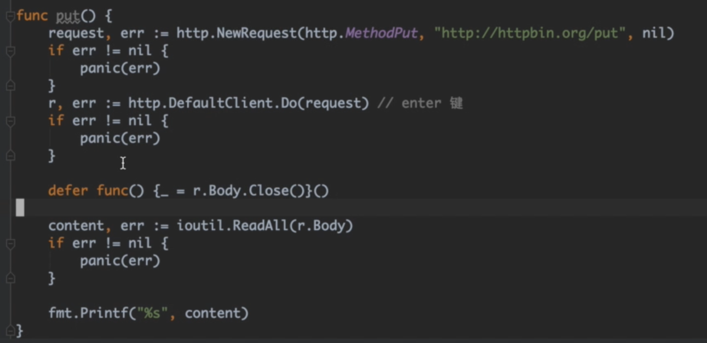

# UPC backend by GO

## Go 作为客户端 自定义请求

因为net/http包只带Get和Post方法，所以需要自定义Put等其他方法



<https://www.bilibili.com/video/BV1NJ411r7vd?p=2&vd_source=e2f6ca112db9a4d4b95eb7b2668125fa>

## 请求体

可以用net/url包来组织请求参数

```go
params := make(url.Values)
params.Add("name", "you_name")
params.Add("age", "25")
```
